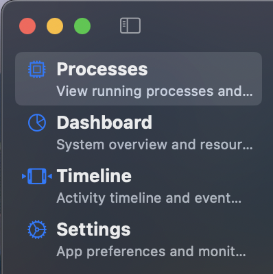
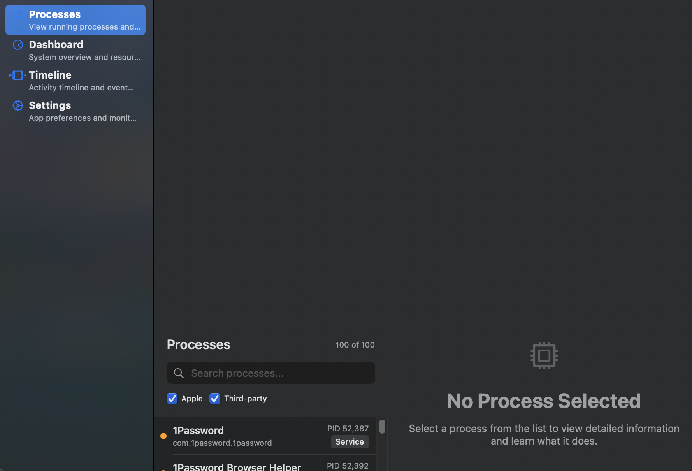
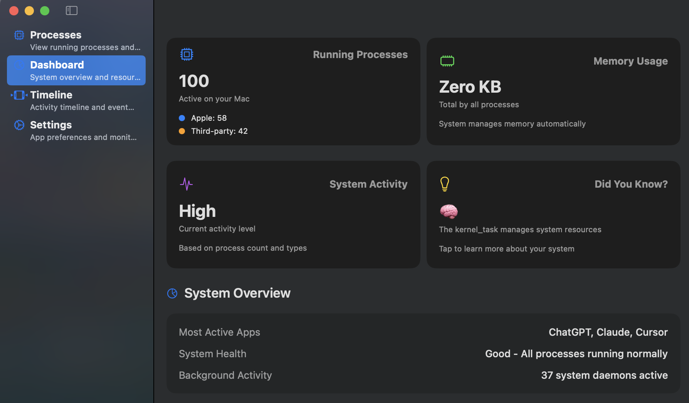
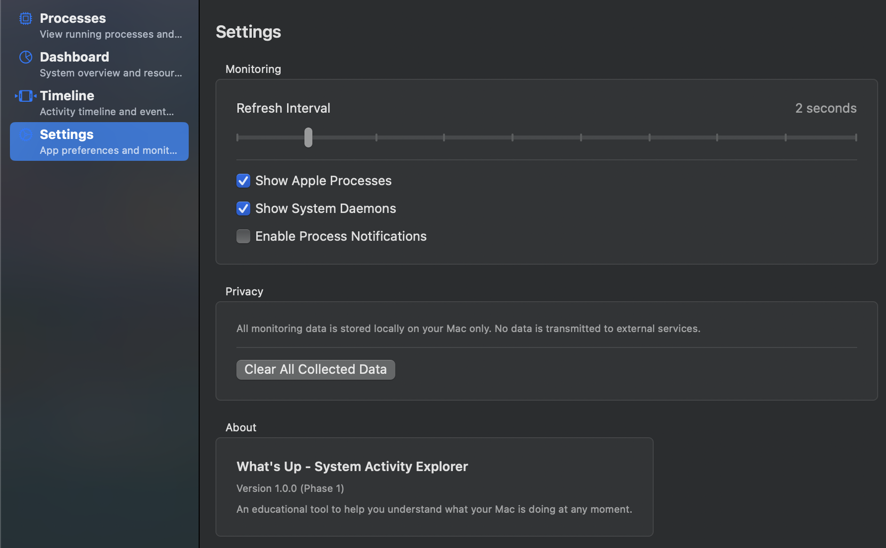
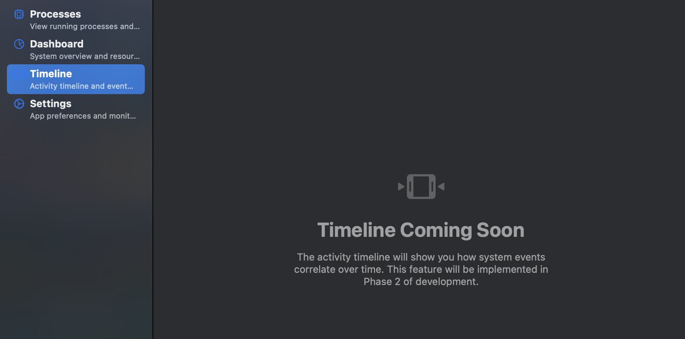

# What's Up - macOS System Activity Explorer

An educational macOS application that reveals the hidden activity on your computer, making the invisible visible. This tool helps you understand what your Mac is doing at any moment, how different components interact, and what constitutes "normal" behavior for your system.

## 🎯 Project Vision

**What's Up** transforms the complexity of macOS system monitoring into an intuitive learning experience. Rather than just showing you data, it explains what everything means, why it matters, and how the pieces fit together.

### Core Learning Objectives

- **Demystify the Black Box**: Understand what's actually happening when you click an app, browse a website, or save a file
- **Establish Baselines**: Learn what's "normal" for your specific Mac and usage patterns  
- **Trace Cause & Effect**: See the ripple effects of actions across the system
- **Understand Relationships**: Visualize how processes, files, network, and hardware interact
- **Build Mental Models**: Develop intuition about system behavior

## 📸 Screenshots

### Main Interface

*The main application window showing the sidebar navigation and overall interface design*

### Process Explorer

*Real-time process list with Apple vs third-party categorization and search functionality*

### Dashboard Overview

*System overview with metrics cards showing process counts, system activity, and educational insights*

### Settings & Configuration

*Application preferences and monitoring configuration options*

### Timeline View (Coming Soon)

*Placeholder for the upcoming activity timeline feature in Phase 2*

## ✨ Features

### Phase 1: Foundation (Current)
- **Real-time Process Monitoring**: Live process list with automatic updates
- **Educational Explanations**: "What is this?" and "Why is it running?" for every process
- **Smart Categorization**: Distinguish between Apple system processes and third-party apps
- **Interactive Dashboard**: System overview with key metrics and insights
- **Process Hierarchy**: Understand parent-child relationships between processes
- **Search & Filter**: Find specific processes and filter by type
- **Resource Usage**: Monitor CPU and memory usage patterns

### Coming Soon (Future Phases)
- **Activity Timeline**: Visual timeline showing system events and correlations
- **Network Insights**: See where your Mac communicates and why
- **File System Observatory**: Track file changes and app interactions
- **Resource Analysis**: Deep dive into CPU, memory, and energy usage
- **Learning Mode**: Guided tutorials and interactive experiments
- **System Intelligence**: Pattern recognition and anomaly detection

## 🚀 Installation

### Requirements
- macOS 14.0 or later
- Xcode 15.0+ (for development)
- Swift 5.9+

### Building from Source

1. **Clone the repository**
   ```bash
   git clone https://github.com/Matthew-Redrup/whats-up.git
   cd whats-up
   ```

2. **Build with Swift Package Manager**
   ```bash
   swift build
   ```

3. **Run the application**
   ```bash
   swift run WhatsUp
   ```

### Alternative: Xcode
1. Open the project directory in Xcode
2. Select the `WhatsUp` scheme
3. Build and run (⌘R)

## 🎮 Usage

### Getting Started

1. **Launch the app** - The application will immediately start monitoring your system
2. **Explore the sidebar** - Navigate between Processes, Dashboard, Timeline, and Settings
3. **Select a process** - Click any process in the list to see detailed information
4. **Learn as you go** - Read the educational explanations for each component

### Understanding the Interface

#### Sidebar Navigation
- **Processes**: Real-time list of running processes with detailed information
- **Dashboard**: System overview with metrics and insights
- **Timeline**: (Coming in Phase 2) Activity correlation over time
- **Settings**: Configure monitoring preferences and privacy options

#### Process List
- **Blue dot**: Apple/system processes
- **Orange dot**: Third-party applications
- **Search bar**: Filter processes by name or bundle identifier
- **Toggles**: Show/hide Apple or third-party processes

#### Process Details
- **What is this?**: Plain English explanation of the process
- **Why is it running?**: Context about why this process exists
- **Process Info**: Technical details like PID, bundle path, launch time
- **Resource Usage**: Current CPU and memory consumption

## 🏗️ Architecture

### System Design

```
┌──────────────────────────────────────────┐
│         Interactive Dashboard            │
│    (SwiftUI - Main Learning Interface)   │
├──────────────────────────────────────────┤
│         Activity Timeline                │
│    (Correlate events across time)        │
├──────────────────────────────────────────┤
│         Relationship Graph               │
│    (Visual system connections)           │
├──────────────────────────────────────────┤
│         Learning Mode                    │
│    (Guided exploration & tutorials)      │
└────────────────┬─────────────────────────┘
                 │
┌────────────────▼─────────────────────────┐
│         Core Engine                      │
│    (Event correlation & storage)         │
└────────────────┬─────────────────────────┘
                 │
      ┌──────────┴──────────┐
      │     Collectors       │
      └─────────────────────┘
```

### Key Components

- **SystemCollector Protocol**: Defines interface for all monitoring components
- **ProcessCollector**: Uses NSWorkspace to monitor running applications and processes
- **SystemEvent**: Core data model for tracking system activity
- **ProcessInfo**: Detailed process information with educational context
- **Educational Layer**: Built-in explanations and learning content

### Technologies Used

- **SwiftUI**: Modern native macOS interface
- **NSWorkspace**: macOS process monitoring APIs
- **Swift Package Manager**: Dependency management and building
- **Foundation**: Core system interaction

## 🛠️ Development

### Project Structure

```
whats-up/
├── Package.swift                 # Swift Package Manager configuration
├── Sources/WhatsUp/
│   ├── WhatsUpApp.swift         # Main application entry point
│   ├── ContentView.swift        # Root navigation view
│   ├── Models/                  # Data models and types
│   │   ├── SystemEvent.swift    # System event data model
│   │   ├── ProcessInfo.swift    # Process information model
│   │   └── ...
│   ├── Views/                   # SwiftUI views
│   │   ├── ProcessListView.swift
│   │   ├── DashboardView.swift
│   │   └── ...
│   ├── Collectors/              # System monitoring components
│   │   └── ProcessCollector.swift
│   └── Protocols/               # Core interfaces
│       └── SystemCollector.swift
├── Tests/                       # Test files
└── docs/                        # Documentation
```

### Development Commands

```bash
# Build the project
swift build

# Run the application
swift run WhatsUp

# Run tests (when available)
swift test

# Clean build artifacts
swift package clean
```

### Contributing

1. Fork the repository
2. Create a feature branch (`git checkout -b feature/amazing-feature`)
3. Commit your changes (`git commit -m 'Add amazing feature'`)
4. Push to the branch (`git push origin feature/amazing-feature`)
5. Open a Pull Request

### Code Style

- Follow Swift API Design Guidelines
- Use meaningful variable names that read like prose
- Include educational context for any system-level functionality
- Write clear, self-documenting code
- Add comments for complex system interactions

## 🗺️ Roadmap

### Phase 1: Foundation ✅ (Complete)
**Theme: "What's Running Right Now?"**
- [x] Basic application structure with SwiftUI
- [x] Real-time process monitoring using NSWorkspace
- [x] Educational process explorer with explanations
- [x] Interactive dashboard with system metrics
- [x] Process filtering and search functionality

### Phase 2: Activity Tracking (Weeks 3-4)
**Theme: "What Happens When I Do Something?"**
- [ ] Event collection system for user actions and system responses
- [ ] Visual timeline with multiple tracks
- [ ] Interactive timeline with filtering and zoom
- [ ] "Action Lab" with guided experiments

### Phase 3: Resource Monitoring (Weeks 5-6)
**Theme: "How Are Resources Being Used?"**
- [ ] CPU monitoring with per-core utilization
- [ ] Memory tracking with pressure indicators
- [ ] Disk activity monitoring
- [ ] Energy impact analysis

### Phase 4: Network Insights (Weeks 7-8)
**Theme: "Where Is My Mac Talking To?"**
- [ ] Network connection tracking
- [ ] Traffic pattern visualization
- [ ] Connection mapping with geo-location
- [ ] Privacy-focused network education

### Phase 5: File System Observatory (Weeks 9-10)
**Theme: "What's Happening to My Files?"**
- [ ] FSEvents integration for real-time file monitoring
- [ ] File access pattern analysis
- [ ] Storage insights and space analysis

### Phase 6: System Intelligence (Weeks 11-12)
**Theme: "Understanding the Whole System"**
- [ ] Cross-domain event correlation
- [ ] Pattern recognition and baselines
- [ ] System health scoring
- [ ] Anomaly detection

### Phase 7: Interactive Learning (Weeks 13-14)
**Theme: "Guided System Exploration"**
- [ ] Interactive tutorials and guided tours
- [ ] Experiment mode with predictions
- [ ] Built-in knowledge base and wiki

## 🔒 Privacy & Security

**Privacy First Design:**
- All monitoring data is stored locally on your Mac only
- No network transmission of system data
- User controls for data retention and deletion
- Ability to exclude specific apps/folders from monitoring
- Clear data export and deletion options

**Performance Considerations:**
- Minimal system impact with adjustable monitoring intensity
- Sampling strategies for high-frequency events
- Real-time updates without blocking the UI
- Self-reporting of resource usage by the app itself

## 🤝 Support

### Getting Help
- **Issues**: Report bugs or request features on [GitHub Issues](https://github.com/Matthew-Redrup/whats-up/issues)
- **Discussions**: Ask questions or share ideas in [GitHub Discussions](https://github.com/Matthew-Redrup/whats-up/discussions)

### Educational Resources
- Built-in help and explanations throughout the app
- Process encyclopedia with detailed explanations
- macOS system behavior learning materials

## 📄 License

This project is licensed under the MIT License - see the [LICENSE](LICENSE) file for details.

## 🙏 Acknowledgments

- **Apple** for providing comprehensive system monitoring APIs
- **macOS Activity Monitor** for inspiration on system monitoring UX
- **Educational computing community** for emphasizing learning-first design
- **Open source contributors** who make projects like this possible

---

**What's Up** - Making the invisible visible, one process at a time.

*Built with ❤️ for curious minds who want to understand their Macs better.*